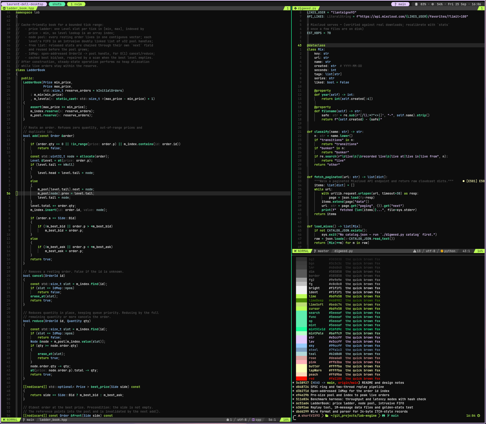

# voidrunner.nvim

Near-black ground, pale accents. Structure is carried by lightness, hue only as a whisper: one lime for what is yours (keywords, titles, the mode you are in), one mint for what arrives (functions, success), lavender for what is elsewhere (strings, visual mode). Comments sit at a deliberate 2.4:1 so they are structure, not content.

Built for C++ and Python: functions carry weight, punctuation and scope noise recede.



## Install

```lua
-- lazy.nvim
{
  "lanteignel93/voidrunner.nvim",
  lazy = false,
  priority = 1000,
  config = function()
    require("voidrunner").setup({ transparent = true })
    vim.cmd.colorscheme("voidrunner")
  end,
}
```

```lua
require("voidrunner").setup({
  transparent = false,               -- draw Normal/floats/Pmenu on the terminal's own background
  styles = {
    comments = { italic = true },
    functions = { bold = true },
    keywords = {},
  },
  dim_inactive = false,
})
```

`require("voidrunner").palette()` returns the colour table if a plugin wants it directly.

## What it covers

Editor, legacy syntax groups, treesitter captures, LSP semantic tokens and diagnostics, and: telescope, snacks (picker, notifier, input, indent, dashboard), gitsigns, blink.cmp, which-key, nvim-notify, noice, nvim-dap and dap-view, mini (files, icons, indentscope), indent-blankline, rainbow-delimiters, todo-comments, markview, fidget, flash, toggleterm, lazygit.nvim, lazy, mason, fugitive. A lualine theme ships at `lua/lualine/themes/voidrunner.lua` and is picked up by `theme = "auto"`.

## Extras

The same palette, rendered for the rest of the terminal and desktop, lives under [`extras/`](extras): kitty, alacritty, tmux, bat, fzf, eza, zsh-syntax-highlighting, lazygit, tuicr, Claude Code, ipython, polybar, awesome, gtk4, Obsidian, Firefox, Slack, spicetify.

## Sibling

[spacecowboy.nvim](https://github.com/lanteignel93/spacecowboy.nvim) is the same highlight map on a desert palette. The two are generated from one source, so anything that works in one works in the other.

## Generated

This repo is a build output. The palette (33 named roles) and the highlight templates live in the `theme/` factory of my dotfiles; `render.py` writes `colors/`, `lua/` and `extras/` here. Issues and pull requests are welcome and get applied upstream, in the template, so both themes receive them.

## Credits

The greys, lime, mint and lavender descend from [darkvoid.nvim](https://github.com/aliqyan-21/darkvoid.nvim) by aliqyan-21 (MIT), which this theme ran as an override layer on for a year before becoming its own thing. The role model, the highlight map and the extras are new.

MIT.
